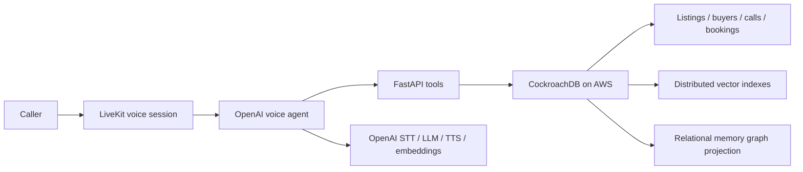

# CockroachDB Hackathon Architecture

## Memory is the product

A returning buyer should not start over. Super Realty turns conversations into durable,
actionable memory and uses that memory on the next live call.



One CockroachDB transaction can update a buyer and append the call memory. The same
database answers operational queries and semantic recall, so a booked showing cannot be
present in one memory system and absent from another.

## Challenge products used

### 1. Distributed Vector Indexing

The migration creates three 1,536-dimensional vector columns and distributed indexes:

```sql
CREATE VECTOR INDEX ix_memory_listings_embedding
ON memory_listings (tenant_id, embedding);

CREATE VECTOR INDEX ix_memory_buyers_embedding
ON memory_buyers (tenant_id, embedding);

CREATE VECTOR INDEX ix_memory_interactions_embedding
ON memory_interactions (tenant_id, embedding);
```

`tenant_id` is a prefix column. It enforces the application's tenant boundary and lets
CockroachDB search the relevant partition of vector space. Listing recall combines exact
constraints and semantic similarity:

```sql
SELECT code, address, price, beds, description
FROM memory_listings
WHERE tenant_id = $1
  AND ($2 IS NULL OR lower(area) LIKE '%' || lower($2) || '%')
  AND ($3 IS NULL OR price <= $3)
  AND ($4 IS NULL OR beds >= $4)
ORDER BY embedding <-> $5::VECTOR
LIMIT $6;
```

OpenAI `text-embedding-3-small` produces normalized 1,536-dimensional embeddings. The
backend bounds concurrent requests, caches repeated catalog embeddings, and falls back to
structured CockroachDB recall when the embedding API is temporarily unavailable.

### 2. ccloud CLI

`infra/aws/provision.sh` uses ccloud's JSON interface to:

- authenticate the operator;
- discover AWS BASIC regions;
- create or reuse the managed cluster;
- create the application SQL user;
- retrieve the connection string;
- place the resulting URL in encrypted AWS Systems Manager Parameter Store.

This is reproducible infrastructure rather than a cluster created manually for a demo.
The CLI also provides the operational surface for cluster info, backups, SQL access, and
audit/health inspection during judging.

## CockroachDB memory model

| Table | Durable agent memory | How the agent acts on it |
|---|---|---|
| `memory_realtors` | Persona, agency, tone, service area | Answers in the realtor's identity |
| `memory_listings` | Structured property facts + embedding | Grounds recommendations in connected inventory |
| `memory_buyers` | Stable phone identity, criteria, summary + embedding | Recognizes returning callers and matches new homes |
| `memory_interactions` | Calls and showing events + embedding | Resumes prior context and explains remembered intent |
| `bookings`, `call_logs` | Transactional outcomes and transcripts | Prevents duplicate bookings and supports follow-up |

All memory tables use explicit `tenant_id` predicates. CockroachDB's default serializable
isolation protects concurrent voice calls; the memory layer retries SQLSTATE `40001` with
bounded exponential jitter.

## AWS deployment

The CloudFormation stack creates:

- an encrypted Amazon Linux EC2 host;
- an Elastic IP for the demo endpoints;
- an EC2 role using SSM Session Manager (no SSH port);
- least-scope access to encrypted SSM parameters;
- security-group rules for the app, API, LiveKit signalling, ICE/TCP, and ICE/UDP.

The EC2 bootstrap clones this repository, reads the OpenAI and CockroachDB URLs from SSM,
generates local JWT/agent/LiveKit secrets, and runs the Docker Compose services. Persistent
agent memory remains in managed CockroachDB Cloud on AWS even when the EC2 app host is
replaced.

Provision and deploy:

```bash
export OPENAI_API_KEY=...
./infra/aws/provision.sh
```

The script prints the application, API, and LiveKit endpoints after CloudFormation reaches
`CREATE_COMPLETE`. Cloud resources can incur charges; remove the stack and CockroachDB
cluster after the event if they are no longer needed.

## Demo path

1. Onboard a realtor and two listings.
2. Call as a new buyer and state area, budget, and bedroom needs.
3. Show the CockroachDB-backed graph and buyer memory in the console.
4. End the call; the summary becomes a vectorized `memory_interactions` row.
5. Call from the same phone number. The agent greets the buyer by name and resumes their
   preferences.
6. Add a new listing and show semantic buyer matching grounded in stored criteria.
